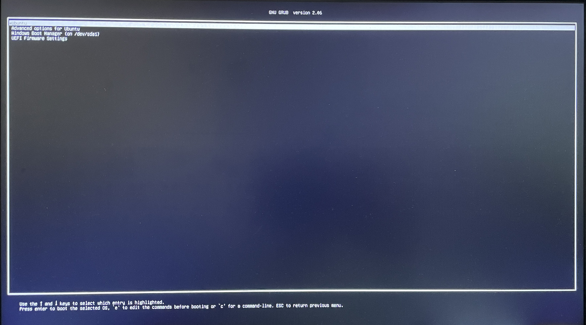
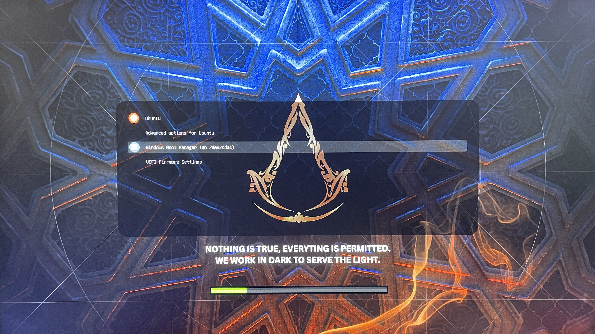

# Grub-theme-assassin
#### A cool grub bootloader theme based on Assassin's Creed, because hey who likes the old school grub menu.  

  
 

## Installation instructions
---
* **Open the Terminal ***(Ctrl+Alt+T).*****
* **Change directory to where you want the setup files to be downloaded.**
* **Run `git clone https://github.com/sagarmandiya/Grub-theme-assassin.git`**
* **Change the directory using `cd ./Grub-theme-assassin/`**
* **Run this command to install the theme `sudo bash ./install.sh`**
* **Once it shows the message ***"successfully installed"***, you are done! Reboot to see the new theme.** 

 
 

## Preview
---
 

**Before**

 

**After**

 
 

## Contact Me:
---
* **Website: [Sagar Mandiya](https://www.sagarmandiya.com/connect)**
* **Blog: [Sagar Mandiya Blog](https://www.sagarmandiya.com/blog)**
* **LinkedIn: [Sagar M](https://www.linkedin.com/in/sagar-m-647a2b183)**
* **Instagram: [Sagar Mandiya](https://www.instagram.com/sagar_mandiya/)**

  

Assassin's Creed is a registered trademark of Ubisoft Entertainment. 
